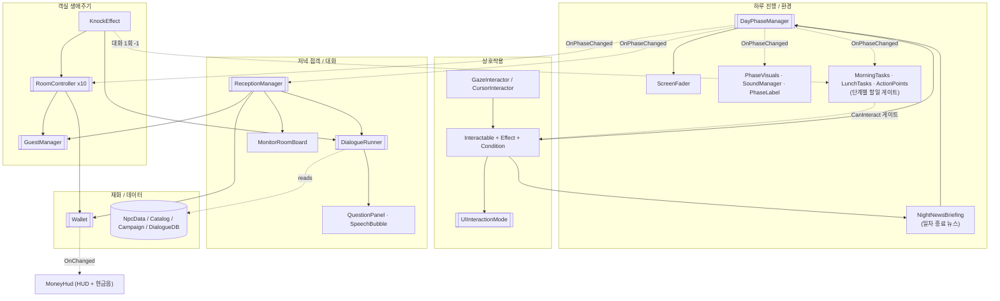

# 넉넉 하우스키핑 (KnockKnock_HouseKeeping)

> 가제: 넉넉 하우스키핑 / 체크아웃 플리즈
> 미국 모텔 운영 시뮬레이션 공포 게임

## 게임 소개

원인 모를 전염병 **"과대 몽유병"**이 퍼진 미국을 배경으로 한 1인칭 모텔 운영 심리 공포 게임.

몽유병 환자는 밤마다 좀비나 괴물처럼 다른 사람을 습격한다. 플레이어는 모텔 주인이 되어 숙박객을 받을지 거절할지 결정해야 하며, TV에서 매일 제공되는 "구별법"만으로 몽유병 환자를 가려내야 한다. 다만 이 구별법은 나폴리탄 괴담처럼 실제 질병과 무관하거나 이해할 수 없는 내용으로 구성되어 있어, 믿을지 말지는 전적으로 플레이어의 선택에 달려 있다.

숙박객 중 몽유병 환자가 있으면 밤마다 확률적으로 다른 숙박객이 살해당하고, 몽유병 환자 수가 정상 숙박객 수보다 많아지면 플레이어가 죽어 게임 오버가 된다.

- **몽유병 1 : 숙박객 1** → 숙박객 또는 플레이어 사망
- **몽유병 n : 숙박객 n** → 숙박객 1명 사망

날이 지날수록 의심스러운 숙박객이 늘어나고, 평화롭던 모텔 주변 분위기는 점점 어두워지며 멀리 보이는 도시도 불타오르는 등 세계관이 붕괴되어 간다.

### 기본 정보

| 항목 | 내용 |
|---|---|
| 시점 | FPS (1인칭) |
| 장르 | 시뮬레이션, 공포 |
| 그래픽 스타일 | 로우폴리 + 픽셀아트, 3D/2D 혼합 |
| 참고 작품 | 노 아임 낫 휴먼, 댓츠 낫 마이 네이버, 페이퍼스 플리즈, 디스 워 오브 마인 |

## 핵심 루프 (하루 일과)

**아침 → 점심 → 저녁(접객) → 새벽** 4단계로 하루가 진행된다 (`DayPhaseManager`). 각 단계는 지정 오브젝트를 상호작용해 넘긴다 — 게시판(아침→점심), 접객 테이블(점심→저녁), 침대(새벽→다음날). **그 단계의 할일을 끝내야** 트리거가 열리며(`InteractionCondition` 게이트), 열리면 HUD 마커 + 벽 너머 외곽선이 "여기로 가라" 를 알려준다 (`ObjectiveMarker` + `OutlineWhileInteractable`). 전환마다 검정 페이드가 조명/앰비언스 스왑을 가려준다 (`ScreenFader` + `PhaseVisuals`), 마우스 커서는 전환 중 숨겨진다.

1. **아침 — 방 청소 / 체크아웃**: 오늘 나가는 손님(`stayNights` 만큼 묵음)의 방이 열린다. **하우스키핑을 요청한 손님** 방은 숙박 중에도 매일 아침 열려 침대를 정리해야 하고, 후불 손님은 이때 숙박비를 낸다 (`RoomController` + `GuestManager`). 우상단 할일 HUD `☐ 침대 개기 3/6` 를 다 채우면(`MorningTasks`) 게시판이 열려 점심 전환
2. **점심 — 일과 처리**: 울타리 수리·불법주차 신고 등. 씬의 `LunchTaskTarget` 을 전부 처리하면(`LunchTasks`) 접객 테이블이 열려 저녁 전환. 일차별 변형·점프스케어는 아직 *(설계 — `doc/0134`)*
3. **저녁 — 숙박객 모집 (접객)**: 저녁이 되면 접객 자리로 **자동 착석** → **UI 모드**(플레이어 고정, 마우스 표시) → 손님이 걸어 들어와 **말풍선 대화**(인사 → 질문 허브 → 선택지) → CRT **모니터로 방 배정**(101~110) → 열쇠를 손에 들고 손님 클릭 = 체크인. 대화에서 숙박 일수·선불/후불·하우스키핑 여부가 정해지고, "신분증 제시" 선택지를 고르면 책상 `ID` 오브젝트로 손님 신분증(이름·생년월일·얼굴)을 확인할 수 있다. 거절하면 손님이 돌아나감. 저녁마다 최대 5명(`maxGuestsPerEvening`). 접객 중에도 슬롯 선택·휠은 되고 던지기·사용만 막힘. 접객을 마치면 정해진 앵커 위치로 빠져나온다
4. **새벽 — 탐문 (행동력 제)**: 자율 이동 복귀. 배정된 방문은 여닫기 대신 **노크** → 화면고정 → 문이 살짝 열리고 문틈으로 손님이 나와 질문 대화(`Situation.Dawn`). 문을 안 열어주는 손님도 있다. **대화가 끝나면 행동력 1 소모**(새벽마다 4, `ActionPoints` — 중간에 ESC로 나가면 소모 안 됨), 다 써야 주인방 침대에서 잘 수 있다. 주인방 `note` 를 읽으면 그날의 "몽유병 환자 구별법"(일차별). 잠들면 **일차 종료 뉴스 브리핑** → 다음날
5. **일차 종료 — 뉴스 브리핑**: 침대에 누우면 암전 중 브리핑 자리로 **순간이동**(조작 차단) → 왼쪽 대화창에 그날 뉴스 나레이션(선택지 없음) + 오른쪽 인게임 TV 슬라이드 (`NightNewsBriefing`, 콘텐츠는 `CampaignData.DayPlan`) → 다 보면 아침으로. 아침 진입 시 화면 중앙에 **"N일차"** (`DayEndTitle`)

**돈**: 시작금 $100, 1박 $70 (`Wallet`). 손님별 `숙박비 = 요금 × 박수`, 선불이면 체크인 시·후불이면 체크아웃 아침에 입금(현금음). 두 배 요금 이벤트도 있음.

일과 중에는 게임 진행에 따른 분위기 변화를 체감할 수 있다 (예: 초반에 쫓아낸 노숙자가 후반엔 시체로 발견되거나, 불법주차 신고 시 경찰이 응답하지 않는 등).

## 전략 요소

모텔 운영 수입으로 인근 상점에서 아이템을 구매할 수 있다.
- 총기·탄약 (몽유병 환자 처치용)
- 강철 문, CCTV, 울타리 등 방어/경영 보조 장비

단, 게임이 중후반으로 진행되면 상점 이용이 제한된다.

## 엔딩

- **정상 엔딩**: 도시가 봉쇄된 상황에서 최대한 많은 비감염자를 모텔에 수용하고, 모텔을 봉쇄한 채 버티기로 결정
- **배드 엔딩**: 플레이어가 몽유병 환자에게 살해당할 경우, 며칠 후 모텔에는 아무도 남지 않는다는 결말로 종료

## 개발 환경

| 구분 | 내용 |
|---|---|
| 엔진 | Unity `6000.4.8f1` |
| 렌더 파이프라인 | Universal Render Pipeline (URP) 17.4.0 |
| 입력 | Unity Input System 1.19.0 (StarterAssets FirstPersonController 기반) |
| 길찾기 | AI Navigation (NavMesh) 2.0.12 |
| 기타 패키지 | Timeline 1.8.12, Visual Scripting 1.9.11, TextMesh Pro |
| 트위닝 | DOTween (`Assets/Plugins/Demigiant`, asmdef 없음 — 자동차 진동·손님 걷기·조명) |
| 외곽선 | QuickOutline (로컬 패치됨 — `doc/0076`) |

## 프로젝트 구조

```
Assets/
├─ My/
│  ├─ Scripts/
│  │  ├─ Interaction/   # 상호작용 시스템 — Core(베이스), Effects(효과: Knock/CheckInGuest 포함),
│  │  │                 #   Conditions(게이트), Drivers(입력), Modes(UI모드), RoomController(객실 관제),
│  │  │                 #   RoomNumberLabel(방번호 라벨), ReceptionIdCard(접객 신분증)
│  │  ├─ Inventory/     # 5슬롯 인벤토리 + 아이템 ID 연결(ItemId/HandItem/HandItemRegistry)
│  │  ├─ Dialogue/      # 대화 시스템 — DialogueRunner/QuestionPanel/SpeechBubble, NpcData/Catalog,
│  │  │                 #   DialogueDatabase(CSV→SO), GuestMover/GuestView, GuestWalkBob(걷기 총총+숨쉬기),
│  │  │                 #   Editor/DialogueImporter
│  │  ├─ Game/          # DayPhaseManager(하루 4단계+페이드), ReceptionManager(저녁 접객),
│  │  │                 #   GuestManager(손님 상태·체크아웃·숙박비), CampaignData, Wallet(돈), PhaseLabel,
│  │  │                 #   MorningTasks/LunchTasks/ActionPoints(단계별 할일·게이트),
│  │  │                 #   NightNewsBriefing(일차 종료 TV), DayEndTitle("N일차"), PhaseMessage,
│  │  │                 #   MainMenu(타이틀 Play/Exit), PauseMenu(InGame Esc 옵션창), SleepwalkerNote(구별법 노트)
│  │  ├─ UI/            # MoneyHud, ActionPointsHud(행동력 4칸), ObjectiveMarker(유도 마커),
│  │  │                 #   ExitHintGauge(나가기 홀드), ScreenMessage(중앙 관찰 문구), HoverTextOutline(버튼 호버)
│  │  ├─ Localization/  # LocalizationManager(영/한, 게임시작 시 확정), LocalizedLabel, Editor/FontTool
│  │  ├─ Environment/   # PhaseVisuals(4단계 라이팅/스카이박스/볼륨), ScreenFader(검정 페이드),
│  │  │                 #   ActiveInPhases(시간대별 on/off — 가로등), CarSpawner(거리 자동차, 낮에만),
│  │  │                 #   LightFlicker(형광등 깜박임), SpriteLightResponse(스프라이트 조명 반응)
│  │  ├─ Audio/         # SoundManager (앰비언스 + 발소리)
│  │  └─ Player/        # FootstepSystem
│  ├─ InGame/           # 씬에 실제로 쓰는 프리팹/머티리얼/사운드/렌더텍스처
│  │  └─ Prefabs/       #   Item(문/커튼/침대/자판기/쓰레기통/쇼핑카트…), MotelRoom, 시간대별 조명
│  └─ Prefabs, Materials # 정리된 3rd-party 프롭(카테고리별, 중복 제거 완료 — doc/0072)
├─ Scenes/              # InGame(본편), SampleScene·TestScene(프로토타입 잔재)
├─ AssetsFolder/        # 3rd-party 원본 에셋 팩 (임포트 상태, HDRP→URP 변환 등)
├─ Editor/              # AssetOrganizer, InteractionMigrator (1회용 마이그레이션)
└─ TextMesh Pro/Examples  # Unity 샘플 잔재 (게임에 미사용). TutorialInfo 는 doc/0124 에서 삭제됨

Docs/                    # 스크립트별 레퍼런스 문서 (역할/필드/동작) — 허브: Docs/Overview.md
doc/                     # 세션별 작업 로그 + 코드 변경 전/후 + 설계 노트, 0001~ 번호 통합
기획/                    # 기능정의서, 핵심컨셉 분석, 상호작용·미니게임 연동 설계안
```

> `Docs/`(복수)와 `doc/`(소문자)는 Windows 대소문자 미구분 때문에 이름을 분리한 것. `Docs/` = 스크립트 문서, `doc/` = 세션 로그.

## 상호작용 시스템

전체 개편 완료 ([`doc/0078`](doc/0078-interaction-system-redesign.md), [`doc/0079`](doc/0079-interaction-effects-reference.md), 노트/모니터·하루 흐름 [`doc/0100`](doc/0100-note-and-monitor-interactions-design.md), 허브 문서 [`Docs/InteractionSystem.md`](Docs/InteractionSystem.md)).

**구 방식** (`InteractionType` enum + 거대 switch에 케이스를 하나씩 추가) → **컴포넌트 조합 방식**으로 전환:

```
GameObject
├─ Interactable            ← 플레이어가 찾는 대상 (디스패처)
├─ InteractionEffect …     ← 실제 동작 (여러 개 스택)
└─ InteractionCondition …  ← 상호작용 가능 여부 게이트 (선택)
```

### 작업 흐름

큰 행동 카테고리를 `Interactable` 의 **Prompt Type** 으로 지정 → 컴포넌트 **우클릭 "Prompt Type에 맞게 효과 재설정"** →
해당 카테고리 표준 스크립트 자동 추가/정리(+콜라이더·Interaction 레이어·Outline·컴포넌트 순서) → 각 효과의 오브젝트/클립 필드 수동 연결 → 완성.

행동 카테고리에도 들어가기 힘든 특별한 작동만 새 `InteractionEffect` 서브클래스를 만들어 붙인다. 큰 틀은 건드리지 않는다. 기존 행동에 옵션을 추가하거나 새 행동이 필요하면 카테고리/효과를 추가한다.

### 행동 카테고리 & 효과

| 카테고리 | 붙는 효과 | 구 방식 |
|---|---|---|
| 여닫기 (열기/닫기) | `HingeEffect` + `SfxEffect` | `Door` |
| 켜고끄기 (켜기/끄기) | `ChangeObjectEffect` + `SfxEffect` | `Curtain` |
| 정리하기 | `ChangeObjectEffect` + `SfxEffect` | `TidyBed` |
| 줍기 | `PickupEffect` + `SfxEffect` + `ItemImpactSound` | `Pickup` / `Flashlight` |
| 사용 | `SpawnObjectEffect` + `SfxEffect` | `ItemDispenser` |
| 밀기 | `PushEffect` + `SfxEffect` + `ItemImpactSound` | `Push` |
| 걸기 | `HookEffect` + `SfxEffect` | (신규 — 열쇠고리) |
| 화면고정 | `EnterUIModeEffect` + `SfxEffect` | 구 `접객` (접객 자리·연출 — Backspace 홀드로만 나감) |
| 읽기 | `ShowPanelEffect` + `SfxEffect` | (신규 — 노트/편지/사진) |
| 노크 | `KnockEffect` + `SfxEffect` | (신규 — 새벽 배정 방문. 화면고정 + 문틈 손님 + 탐문 대화. 행동력 1 소모) |
| 아침·점심 종료 | `PhaseSwitchEffect` + `SfxEffect` + `PhaseCondition` + `TasksCompleteCondition`/`LunchTasksCompleteCondition` | (게시판/접객 테이블 — 할일 완료 게이트) |
| 하루 종료 | `NewsBriefingEffect` + `SfxEffect` + `PhaseCondition` + `ActionPointsDepletedCondition` | (주인방 침대 — 행동력 소진 게이트 → 뉴스 브리핑 → 아침) |
| 상호작용 / 조사 | `SfxEffect` | `Generic` + `UnityEvent` |

특수 효과(카테고리 아님): `CheckInGuestEffect`(손님 클릭 체크인), `InteractableProxyClick`(모니터 화면 배경 클릭 → 모니터 상호작용), `MonitorViewEffect`(모니터 — ESC/재클릭으로 나가는 가벼운 화면고정, 접객 위에 중첩).

- **모든 상호작용에 효과음** — `SfxEffect` 는 항상 포함. `[RequireComponent(AudioSource)]` 로 자동 부착.
- **on/off 상호작용은 소리 2개** — 토글이면 `SfxEffect` 가 `onClip` / `offClip` 을 따로 재생.
- **획득 아이템은 ID로 연결** — 줍는 프리팹의 `PickupEffect.itemId` ↔ 플레이어 손 오브젝트의 `HandItem.id` (`HandItemRegistry` 가 매칭). 손전등=001, 소다=002.
- **하루 진행 트리거** — 게시판(아침종료 Morning→Noon)·접객 테이블(점심종료 Noon→Evening)은 `PhaseSwitchEffect`, 주인방 침대(하루종료 Dawn→Morning)는 `NewsBriefingEffect`(브리핑 후 전환). 재설정 시 `from/to`·`PhaseCondition.allowedPhases` 자동 세팅. 저녁→새벽은 접객 종료 시 `ReceptionManager` 가 자동 전환. 각 트리거에 해당 단계 할일 완료 `InteractionCondition` 게이트 + `ObjectiveMarker` 유도.

### 핵심 스크립트

각 스크립트 상세(필드·동작)는 [`Docs/`](Docs) 폴더 참조 (허브: [`Docs/Overview.md`](Docs/Overview.md)).

| 스크립트 | 역할 | 문서 |
|---|---|---|
| `Interactable` | 디스패처. promptType/isToggle/onInteracted, 효과 실행, 우클릭 재설정 메뉴 | [doc](Docs/Interactable.md) |
| `InteractionEffect` | 효과 추상 베이스 + `InteractionContext` 구조체 | [doc](Docs/InteractionEffect.md) |
| `InteractionCondition` | 게이트 추상 베이스 (`IsMet`) | [doc](Docs/InteractionCondition.md) |
| `SfxEffect` | 효과음. 토글이면 on/off 2클립, `interrupt` 시 이전 소리 끊고 교체 | [doc](Docs/SfxEffect.md) |
| `ChangeObjectEffect` | `onObjects`/`offObjects` SetActive 스왑 (침대·커튼) | [doc](Docs/ChangeObjectEffect.md) |
| `HingeEffect` | 경첩 회전 여닫기. `hinge` Transform·`axis` 직접 지정 (문·쓰레기통 뚜껑) | [doc](Docs/HingeEffect.md) |
| `PushEffect` | 부모 Rigidbody 를 주체 반대로 임펄스+토크 (쇼핑카트) | [doc](Docs/PushEffect.md) |
| `PickupEffect` | `InventorySystem.AddItem`. `itemId` 로 손 오브젝트 조회 | [doc](Docs/PickupEffect.md) |
| `SpawnObjectEffect` | 프리팹 생성, `maxCount` 제한 (자판기) | [doc](Docs/SpawnObjectEffect.md) |
| `HookEffect` | 손에 든 열쇠를 빈 고리에 걸어 고정 (열쇠고리) | [doc](Docs/HookEffect.md) |
| `EnterUIModeEffect` | `UIInteractionMode.Enter(anchor)` — `화면고정` (모니터/컴퓨터) | [doc](Docs/EnterUIModeEffect.md) |
| `ShowPanelEffect` | 오브젝트 켜고 플레이어 정지 — `읽기` (노트/편지/사진) | [doc](Docs/ShowPanelEffect.md) |
| `PhaseSwitchEffect` | 상호작용으로 하루 단계 `from→to` 전환 (게시판/테이블/침대) | [doc](Docs/PhaseSwitchEffect.md) |
| `PhaseCondition` | 지정 하루 단계에서만 상호작용 허용 | [doc](Docs/PhaseCondition.md) |
| `GazeInteractor` | 화면중앙 레이 + 아웃라인 + E, 벽 너머 차단 (구 `InteractionOutline`) | [doc](Docs/GazeInteractor.md) |
| `CursorInteractor` | 마우스 레이 + 좌클릭, UI 모드 전용, RenderTexture 커서 보정 + 가림 체크 | [doc](Docs/CursorInteractor.md) |
| `UIInteractionMode` | UI 모드 — 앵커 스택(접객/모니터/노트), 플레이어 고정, 커서, ESC 한 겹씩 | [doc](Docs/UIInteractionMode.md) |
| `DayPhaseManager` | 아침/점심/저녁/새벽 순환 + `ScreenFader` 페이드 전환, `OnPhaseChanged` | [doc](Docs/DayPhaseManager.md) |
| `ReceptionManager` | 저녁 접객 세션 — 손님 큐(셔플, 저녁당 최대 `maxGuestsPerEvening`), 대화, 모니터 방배정, 체크인+숙박비 | [doc](Docs/ReceptionManager.md) |
| `ReceptionIdCard` | 접객 대화 `id_show` 노드 → 책상 `ID` 오브젝트 활성 + 신분증 UI(이름·생년월일·얼굴 크롭) | `doc/0168`·`0173` |
| `GuestManager` | 손님 상태(`GuestState`) — 판정·방·숙박 박수·하우스키핑·숙박비·체크아웃 | [doc](Docs/GuestManager.md) |
| `RoomController` | 객실 ×10 관제 — 배정 손님 있으면 문 잠금/노크 전환, 아침 청소 창 개방·침대 흐트러뜨림, 체크아웃 정산, 잠금 시 커튼/소등 | [doc](Docs/RoomController.md) |
| `RoomNumberLabel` | `Room_Number` 큐브 Canvas 에 `RoomController.RoomNumber` 표시 (`ExecuteAlways`, 큐브 비균등 스케일 보정) | `doc/0161` |
| `SleepwalkerNote` | 주인방 `note` 읽기 → 일차별 몽유병 구별법 목록 (`CampaignData.DayPlan.sleepwalkerHints`) | `doc/0171` |
| `KnockEffect` | 새벽 노크 → 화면고정 + 문틈 손님 + 탐문 대화. 새벽 아니면 항상 거절. 대화 1회 = 행동력 1 | [doc](Docs/KnockEffect.md) |
| `MorningTasks` / `TasksCompleteCondition` | 아침 할일 HUD `☐ 침대 개기 N/M` (방 messy 합산) + 완료 시 게시판 개방 | [doc](Docs/MorningTasks.md) |
| `LunchTasks` / `LunchTaskTarget` / `LunchTasksCompleteCondition` | 점심 일과 HUD + 오브젝트별 1회 처리 + 완료 시 접객 테이블 개방, 아침에 재활용 | [doc](Docs/LunchTasks.md) |
| `ActionPoints` / `ActionPointsDepletedCondition` / `ActionPointsHud` | 새벽 행동력 4 (대화당 -1), 소진 시 잠자기 가능. `ForceDeplete()` 소비 아이템용 | [doc](Docs/ActionPoints.md) |
| `NightNewsBriefing` / `NewsBriefingEffect` | 일차 종료 — 순간이동 + 왼쪽 뉴스 나레이션 + 오른쪽 인게임 TV → 아침 | [doc](Docs/NightNewsBriefing.md) |
| `DayEndTitle` / `PhaseMessage` | 아침 진입 시 "N일차" 중앙 크게 / 지정 단계 진입 완료 시 화면 중앙 문구 1회 | [doc](Docs/DayEndTitle.md) |
| `ObjectiveMarker` / `OutlineWhileInteractable` / `ExitHintGauge` | HUD 유도 마커 + 벽 너머 외곽선 (하루 진행 트리거) + 나가기 홀드 게이지 | [doc](Docs/ObjectiveMarker.md) |
| `MonitorRoomBoard` | CRT 모니터 uGUI 방배정 보드 (101~110, 빈방/선택/사용중) | [doc](Docs/MonitorRoomBoard.md) |
| `MonitorViewEffect` | 모니터 화면고정 — 클릭 진입, ESC/재클릭 해제, 접객 위에 중첩 | [doc](Docs/MonitorViewEffect.md) |
| `CheckInGuestEffect` | 접객 중 손님 클릭 → 열쇠 소모 + 체크인 승인 | — |
| `RenderTextureGraphicRaycaster` | 오브젝트 화면(CRT) World Space Canvas 클릭 좌표 보정 (RT 파이프라인) | [doc](Docs/RenderTextureGraphicRaycaster.md) |
| `DialogueRunner` / `QuestionPanel` / `SpeechBubble` | 대화 1회 오케스트레이션(인사→허브→분기), 질문/선택지 버튼, 타이핑 말풍선 | [hub](Docs/DialogueSystem.md) |
| `NpcData` / `NpcCatalog` / `CampaignData` / `DialogueDatabase` | 손님 정체성 SO, 번호→NpcData, 일차 편성, CSV→대사 DB(임포터) | [hub](Docs/DialogueSystem.md) |
| `GuestMover` / `GuestView` | 접객 손님 웨이포인트 이동, 스프라이트/표정 교체 | [hub](Docs/DialogueSystem.md) |
| `Wallet` / `MoneyHud` | 소지금($100 시작), 1박 $70, 선불/후불/2배, HUD(`$` 초록) + 현금음 | [doc](Docs/Wallet.md) |
| `ScreenMessage` | 화면 중앙 임시 관찰 문구 ("노크가 거절됐다") | [doc](Docs/ScreenMessage.md) |
| `LocalizationManager` | 영/한 — 게임 시작 시 언어 확정, `T(en, ko)` 읽기 전용 | [doc](Docs/LocalizationManager.md) |
| `PhaseLabel` | HUD 시간대 텍스트 ("Day 3 · Evening") | [doc](Docs/PhaseLabel.md) |
| `ItemId` / `HandItem` / `HandItemRegistry` | 획득 아이템 프리팹 ↔ 손 오브젝트 번호 연결 | [doc](Docs/HandItemRegistry.md) |
| `InventorySystem` | 5슬롯, 줍기/장착/사용/던지기, 손전등 슬롯 특수 | [doc](Docs/InventorySystem.md) |
| `ItemImpactSound` | 물리 충돌 시 임팩트 사운드 (줍기·밀기 자동 추가) | [doc](Docs/ItemImpactSound.md) |
| `CartGroundAlign` | 쇼핑카트 4바퀴 레이캐스트로 바닥 기울기 정렬 (진행 중) | [doc](Docs/CartGroundAlign.md) |
| `SoundManager` | 앰비언스(밤/낮, `OnPhaseChanged` 구독) + 지면 레이어별 발소리 | [doc](Docs/SoundManager.md) |
| `FootstepSystem` | 이동 거리 누적 → 발소리 타이밍, 지면 레이어 판정 | [doc](Docs/FootstepSystem.md) |
| `PhaseVisuals` | 4단계 스카이박스/라이트/볼륨/fog 스왑 (구 `DayNightSwitcher`) | [doc](Docs/PhaseVisuals.md) |
| `ScreenFader` | 전체 화면 검정 페이드 (`FadeThrough`) | [doc](Docs/ScreenFader.md) |
| `ActivateOnAwake` | 시작 시 지정 오브젝트 활성화 (페이드 오버레이 등) | [doc](Docs/ActivateOnAwake.md) |
| `ActiveInPhases` | 지정 시간대에만 오브젝트 on/off (가로등 저녁·새벽 점등) | [doc](Docs/ActiveInPhases.md) |
| `CarSpawner` | 거리 자동차 주기 스폰 + 직선 주행 + DOTween 엔진 진동. `activePhases`(기본 아침·점심)에만 스폰 | [doc](Docs/CarSpawner.md) |
| `LightFlicker` | Light 를 고장난 형광등처럼 랜덤 깜박임(소등/stutter/버즈) + 선택 사운드 (MainScene 네온 간판) | `doc/0170` |
| `SpriteLightResponse` | NPC 스프라이트(`SpriteRenderer.color`)를 주변 조명 밝기에 곱해 어둡게/밝게 (URP 3D, 셰이더 교체 없이) | `doc/0179` |
| `GuestWalkBob` | 손님 걷는 동안 스프라이트 상하 총총 + 좌우 흔들, 멈추면 idle 숨쉬기 (DOTween) | `doc/0172`·`0180` |
| `MainMenu` / `PauseMenu` | 타이틀 Play(→InGame)/Exit · InGame `Esc` 옵션창("메인화면으로 나가기", 노트/모니터/노크 중엔 억제) | `doc/0165`·`0166` |
| `HoverTextOutline` | UI 버튼 호버 시 자식 TMP 글자색 + 외곽선 노랑 (인스턴스 머티리얼) | `doc/0169` |

## 코드 아키텍처

전체 스크립트 관계도(호출·이벤트·데이터, 서브시스템별 mermaid 11개 + 시퀀스 + 이미지 생성 AI용 스펙)는
**[`기획/코드-아키텍처.md`](기획/코드-아키텍처.md)** 참조 (돈·체크아웃까지 반영, 일과 게이트·뉴스 브리핑은 미반영 — `doc/0139`). 아래는 최상위 요약.



**핵심 축 2개**: `DayPhaseManager`(시간) + `Interactable`+`Effect`(플레이어 행동). 나머지는 이 둘이 이벤트/호출로 깨우는 반응 시스템.

## 구현 완료 기능

### 플레이어 / 이동
- [x] 1인칭 이동/시야 (StarterAssets FirstPersonController)
- [x] 이동 거리 기반 발소리 + 지면 레이어(Wood/Concrete/Metal/Grass)별 클립 + 스프린트 피치
- [x] 손전등 (인벤토리 손전등 슬롯 특수 처리 — 켜져 있으면 휠 슬롯 전환 잠금)

### 상호작용 시스템 (개편)
- [x] `Interactable` + `InteractionEffect` 컴포넌트 조합 구조 — enum+switch 방식 폐기
- [x] 효과 10종(Sfx/ChangeObject/Hinge/Push/Pickup/SpawnObject/Hook/EnterUIMode/ShowPanel/PhaseSwitch) + 조건 1종 + 입력 드라이버 2종 + UI 모드 매니저
- [x] `GazeInteractor` — 화면중앙 레이, 아웃라인, E키, **벽 너머 상호작용 차단**(가림 2차 레이캐스트, `doc/0077`). `CursorInteractor` 도 동일 가림 체크
- [x] `HookEffect` — 손에 든 열쇠를 빈 고리에 걸기 (`걸기` 프롬프트, `doc/0087`~`0090`)
- [x] `Interactable` 우클릭 **"Prompt Type에 맞게 효과 재설정"** — 카테고리별 표준 효과 추가/제거, 콜라이더·Interaction 레이어·Outline 자동, 컴포넌트 순서 정렬(메쉬→콜라이더→스크립트→사운드→나머지)
- [x] 모든 상호작용 효과음 + 토글 상호작용 on/off 소리 분리
- [x] `HingeEffect` — `hinge` Transform·`axis` 지정으로 문/쓰레기통 뚜껑 등 임의 축 여닫기
- [x] 획득 아이템 ID 연결 — `ItemId` enum + `HandItem` + `HandItemRegistry` (프리팹 ↔ 손 오브젝트)
- [x] 구 프리팹 → 신 구조 1회용 마이그레이션 스크립트 (`Editor/InteractionMigrator.cs`)
- [x] 스왑되는 메쉬(침대/커튼)의 외곽선 유지 — QuickOutline 로컬 패치 (`doc/0076`)

### 인벤토리
- [x] 5슬롯, 아이템 줍기(`PickupEffect`)/슬롯 선택(1~5)/사용(좌클릭)/던지기(F)
- [x] 던질 때 원본 픽업 오브젝트 되살려 Rigidbody 부착 + 플레이어 콜라이더 충돌 무시 + 벽 관통 방지 스피어캐스트

### 하루 진행 / 환경
- [x] `DayPhaseManager` — 아침→점심→저녁→새벽 순환, `ScreenFader` **검정 페이드 전환**(암전 시 상태 갱신 + `OnPhaseChanged`, 페이드 인 후 `OnPhaseChangeFinished`), `Transitioning` 가드, 디버그 `N`/`Q` 키
- [x] `PhaseSwitchEffect` — 게시판(아침→점심)·접객 테이블(점심→저녁) 상호작용으로 단계 전환. 침대(새벽→아침)는 `NewsBriefingEffect`. `from`/`to` + `PhaseCondition` 은 재설정 시 자동
- [x] **단계별 할일 게이트** — 트리거 오브젝트에 `InteractionCondition` 을 얹어 그 단계 할일을 끝내야 열림:
  - 아침 = `MorningTasks`(우상단 `☐ 침대 개기 N/M`, 방별 랜덤 messy 침대 합산) + `TasksCompleteCondition` → 게시판
  - 점심 = `LunchTasks`(씬의 `LunchTaskTarget` 합산, 오브젝트별 1회 처리·아침에 재활용) + `LunchTasksCompleteCondition` → 접객 테이블
  - 새벽 = `ActionPoints`(행동력 4, 새벽 대화당 -1, `Can_Coke` 등은 `ForceDeplete`) + `ActionPointsDepletedCondition` → 주인방 침대
- [x] **유도 표식** — 트리거가 열리면 `ObjectiveMarker`(HUD 다이아몬드, ScreenSpaceOverlay 라 PxlCrush 무관, 화면 밖이면 가장자리 클램프) + `OutlineWhileInteractable`(벽 너머 흰 외곽선) + 진입 시 `ScreenMessage` 1회. 나가기 홀드 게이지 `ExitHintGauge`
- [x] `PhaseVisuals` — 4단계 스카이박스/라이트 묶음/URP 볼륨/포그 스왑 (`OnPhaseChanged` 구독, 구 `DayNightSwitcher` 대체·삭제)
- [x] `SoundManager` — `OnPhaseChanged` 구독, 저녁·새벽=밤 / 아침·점심=낮 앰비언스 (구 `Q` 토글 삭제), 발소리 재생
- [x] `PhaseLabel` — HUD 시간대/일차 텍스트, `PhaseMessage` — 지정 단계 진입 완료 시 화면 중앙 문구 1회
- [x] **시간대 전환 중 마우스 커서 숨김** (`doc/0151`)
- [x] HUD 텍스트 BG 자동 크기 — ScreenMessage/DayEndTitle/Money/Watch 배경이 텍스트 길이·크기 따라 늘어남 (`ContentSizeFitter`, `doc/0159`)
- [x] `ActionPointsBar` pip 4칸 왼쪽에 "행동력" 라벨 (`doc/0166`), `DayEndTitle` "N일차" 사라짐 속도 조정 (`doc/0168`)

### 일차 종료 연출 (뉴스 브리핑, `doc/0145`)
- [x] `NewsBriefingEffect` — 새벽 침대 상호작용 시, 브리핑이 있으면 재생하고 없으면 바로 아침 전환
- [x] `NightNewsBriefing` — 여는 페이드 → 암전 중 `briefingAnchor` 로 **순간이동**(`FreezeForOverlay` — 이동 연출 없이 즉시, 조작 차단) → 왼쪽 대화창 뉴스 나레이션(선택지 없음, 줄마다 진행) + 오른쪽 인게임 TV 슬라이드 → 닫는 페이드 중 원위치 복원 + `TransitionTo(Morning)` → 아침. 브리핑 동안 다른 HUD 전부 숨김, 소프트락 방지 페이드 래퍼. 매 일차 작동(대사집 없는 날은 대체 문구)
- [x] 콘텐츠 = `CampaignData.DayPlan.newsLinesEn/Ko` + `newsSlides` (일차로 조회, 없으면 1일차 폴백)
- [x] `DayEndTitle` — 다음 날 아침 진입 시 화면 중앙에 **"N일차"** 크게 페이드 (1일차엔 안 뜸, `doc/0150`·off-by-one `doc/0157`)

### 환경 / 분위기
- [x] `CarSpawner` — 도로 자동차 주기 스폰, 스폰 포인트 forward 로 직선 주행 후 소멸, DOTween 셰이크 엔진 진동 (`doc/0148`). **아침·점심에만 스폰**, 저녁·새벽엔 정지 (`doc/0177`)
- [x] `ActiveInPhases` — 가로등(`street light`) 램프+광원을 저녁·새벽만 점등 (`doc/0156`)
- [x] `LightFlicker` — 고장난 형광등 깜박임(소등/stutter/버즈 상태머신) + 선택 사운드, MainScene 네온 간판 (`doc/0170`)
- [x] `SpriteLightResponse` — NPC 스프라이트가 주변 조명 밝기에 반응해 어두워짐/밝아짐 (URP 3D, `color` 곱, `doc/0179`)
- [x] `GuestWalkBob` — 손님 걷기 총총 상하튐 + 좌우 흔들, 멈추면 숨쉬기 (DOTween, `doc/0172`·`0180`)
- [x] `RoomNumberLabel` — `Room_Number` 큐브에 방 번호(101~110) 자동 표시 (`doc/0161`)
- [x] InGame 씬 전면 실시간 조명(라이트맵 미사용, `doc/0149`) + 오클루전 컬링 베이크 (`doc/0152`)
- [x] 모텔 맵 리모델링(임시), 맵 위 자동차
- [x] `Poster` 프리팹 — 겹쳐 있던 회색 Lit 판 제거로 이미지 하얗게 뜨던 문제 수정 (`doc/0174`)

### UI 모드
- [x] `UIInteractionMode` — **앵커 스택**: 플레이어를 `Player_Anchor` 로 이동·고정, 커서 표시, `Gaze`↔`Cursor` 전환. 접객(하위) 안에서 모니터(상위) 중첩, ESC 로 한 겹씩 벗김. `MovementLocked` — 화면고정/오버레이 중 발소리 등 이동 연출 차단 (`doc/0142`)
- [x] `EnterUIModeEffect`(`화면고정`) — 접객 자리·연출용. Backspace 홀드로만 나감(`ExitHintGauge` 게이지). `MonitorViewEffect` — 모니터 줌인, ESC/재클릭으로 나가고 접객 위에 중첩 (`doc/0144`). `CursorInteractor` 로 화면 버튼 클릭 (RenderTexture 커서 좌표 보정, `doc/0099`·`0119`)
- [x] `CursorInteractor` — 화면 UI(모니터 방배정 버튼) 호버 시에도 **모니터 메쉬 외곽선** (`doc/0141`)
- [x] `ShowPanelEffect`(`읽기`) — 노트/편지 상호작용 시 오브젝트 켜고 플레이어 정지. ESC 계층에서 노트가 우선 소비
- [x] `ScreenFader` + `ActivateOnAwake` — Overlay 검정 페이드, 에디터에선 꺼두고 런타임에 켬
- [x] `PauseMenu` — InGame `Esc` → 옵션창("메인화면으로 나가기" → `MainScene`). 노트/모니터/새벽 노크 대화 중엔 그 뷰만 빠져나가고 옵션창 억제, 접객 중엔 열림 (`doc/0166`)
- [x] `MainMenu` + `HoverTextOutline` — MainScene Play/Exit 버튼 배선(EventSystem 추가), 호버 시 글자색·외곽선 노랑 (`doc/0165`·`0169`)
- [x] 화면 비율 — `MainCamera` → 고정 1280×720 RT, `RawImage` 에 `AspectRatioFitter`(FitInParent) + 레터박스 BG 로 비 16:9 창에서도 왜곡 없음 (`doc/0162`). CRT 모니터 화면은 재클릭/ESC/`Road_Image` 클릭으로 나감

### 대화 / 접객 (저녁)
- [x] `DialogueRunner` — 대화 1회: **인사 → 질문 허브(반복 선택) → 선택지 분기 → 종료**. 거절 노드(`outcome=Rejected`)로 대화 전체 거절. `Reception` / `Dawn` 상황
- [x] **CSV → SO 파이프라인** — `Assets/My/Data/Dialogue/*.csv` → `Tools ▸ Dialogue ▸ Import CSV` → `DialogueDatabase.asset` (끊긴 goto 검사). 영/한 2언어
- [x] `QuestionPanel` — 질문/선택지 버튼. **버튼 5개 이상이면 여러 줄 배열** + 패널 크기 자동 (`doc/0135`). **결정 토픽**(선택지 있는 질문: 숙박·결제·신분증)은 한 번 고르면 사라짐 = 번복 불가 (`doc/0138`)
- [x] `SpeechBubble` — 타이핑 연출 말풍선, 클릭/E/Space 진행, 줄별 표정(Neutral/Angry)
- [x] `ReceptionManager` 손님 큐 — 손님이 걸어 들어옴(`GuestMover`/`GuestView` 2D 스프라이트) → 대화 → **모니터 방배정** → 열쇠 들고 손님 클릭 = 체크인 → 방으로 이동 / 거절 시 퇴장
- [x] **손님 큐** — `testShuffleAllGuests`(기본 on): 매 저녁 카탈로그 손님(투숙 중 제외)을 셔플해 앞에서 `maxGuestsPerEvening`(기본 5)명. 카탈로그 = `NpcData` 9명(나그네/회사원/거만한 남성/젊은 여성/노인 + 트럭기사/아버지와 아들/사진작가/목사 — `doc/0167`)
- [x] **접객 신분증** — "신분증 제시" 선택지 → 책상 `ID` 활성 + `Canvas/ID_image` 에 손님 이름·생년월일·얼굴(초상화에서 상단 크롭) 표시 (`ReceptionIdCard`, `doc/0168`·`0173`)
- [x] **접객 편의** — 접객 중 슬롯 1~5·휠 인벤토리 이동은 허용, 던지기·사용만 차단 (`doc/0176`). 접객 종료 시 진입 위치가 아닌 지정 앵커로 복귀 (`doc/0178`)
- [x] `MonitorRoomBoard` — CRT 모니터 uGUI 방배정 버튼 101~110 (빈방/선택됨/사용중 색·활성)
- [x] 새벽 **탐문** — 배정 방문 노크 → 화면고정 → 문 살짝 열림 + 문틈 손님 + `Situation.Dawn` 질문 대화. `refusesDawnKnock` 손님은 거절(`ScreenMessage`). 새벽 아닌 시간 노크는 항상 무응답 (`doc/0136`). **대화가 끝나는 시점**에 행동력 1 소모 (중간 ESC 는 소모 안 됨, `doc/0160`)
- [x] `SleepwalkerNote` — 주인방 `note` 읽기 → 그 일차의 몽유병 환자 구별법을 번호 목록으로 (`CampaignData.DayPlan.sleepwalkerHints`, `doc/0171`)

### 객실 생애주기 / 체크아웃 / 하우스키핑
- [x] `GuestManager.GuestState` — 손님별 `stayNights`(숙박 박수) · `cleaningRequested`(하우스키핑) · `nightlyRate`/`payUpfront`/`settled`(숙박비) · `CheckOutDay`
- [x] `RoomController` (방 ×10) — 배정 손님 있으면 **체크인 저녁 빼고 체크아웃까지 정문 잠금** + 노크 상호작용. 잠금 시 커튼 닫고 소등해 창밖에서 방 안 안 보이게 (`doc/0136`)
- [x] **아침 청소 창** — 체크아웃 아침(대청소) + 하우스키핑 허용 손님의 숙박 중 매일 아침 → 문 열림 + 침대를 흐트러진 상태로 → 방 안 `Bed` `CleanUp` 상호작용으로 정리. 체크아웃 아침이 지나면 `GuestManager.CheckOut` → 빈방(모니터 재배정 가능)

### 돈 (`doc/0137`·`0140`)
- [x] `Wallet` — 시작금 **$100**, 1박 **$70**. `Add(amount)` + `OnChanged` 이벤트
- [x] 손님별 `숙박비 = 요금 × 박수`. 대화에서 **선불 수락 → 체크인 시 입금** / **후불(기본) → 체크아웃 아침 입금** (`RoomController`). 입금 시 현금 효과음
- [x] 두 배 요금 이벤트 (`reject_double_accept` — 돌려보내려는 손님이 2배 제안)
- [x] `MoneyHud` — 소지금 HUD 텍스트 (`$` 초록 + 숫자, `doc/0180`) + 입금 효과음

### 로컬라이제이션 (`doc/0107`)
- [x] `LocalizationManager` — 영어/한글, **게임 시작 시 언어 확정**(런타임 전환 없음). `T(en, ko)` / `Korean` 정적 읽기. 대사·버튼·프롬프트·손님 이름이 표시 직전에 읽음. Galmuri11 폰트 + LiberationSans 폴백

### 아트 / 에셋
- [x] 모텔방 프로토타입 모델링/텍스처링 (`Motel_Room` 프리팹), 시간대별 조명 프리팹
- [x] 3rd-party 프롭 정리 — 카테고리별 프리팹/머티리얼 분류, 중복 프롭 3,592개 제거 (`doc/0072`)
- [x] HDRP 전용 에셋 팩(Vintage Living Room 등) URP Lit 로 변환 — 마젠타 깨짐 해결
- [x] 신규 URP 머티리얼 Smoothness 기본 0 규칙, 알파 투명 머티리얼 스윕 절차 확립
- [x] 쇼핑카트 디테일 (진행 중, `CartGroundAlign` — 4바퀴 지면 정렬)

## 로드맵 (미구현)

접객 골격(손님 큐·대화·방배정·체크인·체크아웃·숙박비), 4단계 할일 게이트, 일차 종료 뉴스 브리핑은 섰다. 남은 것:

- [ ] **판별 로직** — 접객 신분증 UI(`ReceptionIdCard`)·주인방 구별법 노트(`SleepwalkerNote`)는 표시까지 됨. 남은 것: 신분증 위조(`idCard.forged`) 판정, TV/노트 구별법을 뉴스 브리핑 슬라이드·`CampaignData` 에 채우기, `isSleepwalker` vs `verdict` 를 밤 판정에 연결 (SYS-04·05)
- [ ] **일과 다종화** — 아침 할일은 "침대 개기" 1종(열쇠 회수·장부 대조 예정), 점심은 테스트용 `LunchTaskTarget` 뿐. 게이트 구조(`*CompleteCondition`)는 완료 (SYS-02, `doc/0133`·`0134`)
- [ ] **점심 일과 내용** — 울타리 수리·노숙자·불법주차 등 실제 이벤트, 일차별 변형, 점프스케어
- [ ] **새벽 행동력 활용** — 행동력 소모/게이트는 완료 (`ActionPoints`). 총기 사용 등 대화 외 소모처가 남음 (SYS-10·11)
- [ ] **상점 UI/구매** (SYS-08), 상점 제한
- [ ] **NPC** 3D 모델 스왑(`NpcData.modelPrefab`), 이동/경로, 몽유병 습격 연출
- [ ] **몽유병 판별/살해 시뮬레이션** — 밤마다 감염자 수 대비 확률 처리, 게임오버 조건
- [ ] `StoryFlags` 등으로 "밤 판단 → 다음날 결과" 인과 고리 (`기획/상호작용-미니게임-연동-설계안.md`)
- [ ] 세계관 붕괴 연출 (도시 화재, 분위기 변화), 엔딩 분기

## 스크립트 정리 분석

### 삭제 완료 (2026-08-27, `doc/0081` — 마이그레이션 완료 확인 후)

- `Interaction/Door.cs` → `HingeEffect`
- `Interaction/ItemDispenser.cs` → `SpawnObjectEffect`
- `Editor/InteractionMigrator.cs` (1회용)
- `Interactable.cs` 의 `LEGACY` 필드 블록 (`type`, `messyVisual`, `door` …) + `SetEquipTarget`
- `Environment/DayNightSwitcher.cs` → `PhaseVisuals` (2026-08-28, `doc/0100`)

### 삭제 검토 (Unity 템플릿/프로토타입 잔재)

| 대상 | 사유 |
|---|---|
| ~~`Assets/TutorialInfo/`~~ + `Assets/Readme.asset` | **삭제 완료 (doc/0124)** — Unity 템플릿 안내문. `ReadmeEditor` 가 `[InitializeOnLoad]` 로 창 레이아웃을 건드려서 제거 |
| `Assets/TextMesh Pro/Examples & Extras/` | TMP 샘플 씬/스크립트 40여 개. 게임 미사용 |
| `Assets/Scenes/SampleScene.unity`, `TestScene.unity` | 초기 프로토타입 씬. `InGame` 으로 대체됨 |
| `Assets/My/InGame/Editor/StripTestRoomProBuilder.cs` | 특정 테스트룸 ProBuilder 정리용 1회 유틸 — 역할 다했으면 삭제 |
| `Assets/Editor/AssetOrganizer.cs` | 프롭 분류 1회 실행 완료 (`doc/0072`). 재실행 안 하면 삭제, 남길 거면 문서화 |

### 수정 필요 / 개선 여지

| 스크립트 | 내용 |
|---|---|
| `SoundManager` | 게임 규모에 비해 너무 얇음 — BGM, SFX 카테고리 볼륨/뮤트, AudioSource 풀링, 3D 감쇠 등 없음. 접객/공포 연출 들어가기 전 확장 필요 |
| `MorningTasks` / `LunchTasks` / `ObjectiveMarker` | 매 프레임 폴링(`FindObjectsByType` 캐시 + 씬 순회). 태스크·방 규모에서 무시할 비용이지만 대량이면 이벤트로 (`ponytail:` 주석 있음) |
| 하루 진행 트리거 4가지 배선 | 새 `PhaseSwitchEffect`/게이트 오브젝트 추가 시 `Outline`(OutlineAll·흰색·enabled off) + `OutlineWhileInteractable` + `ObjectiveMarker` 를 수동으로 붙여야 함 (자동 아님, `doc/0144`) |
| `NightNewsBriefing.HideHud` | 뉴스 패널과 같은 HUD Canvas 아래 형제를 전부 끔 — `ScreenFader`/`RawImage` 만 예외. 새 HUD 위젯이 다른 Canvas 에 있으면 안 숨겨짐 |
| `ReceptionManager` | `testShuffleAllGuests` 기본 on = 테스트용 무한 셔플. 캠페인 편성으로 전환 시 끄고 `CampaignData` 채우기 |
| `PhaseSwitchEffect` / 게시판·테이블·침대 | 할일 완료 여부와 무관하게 전환 — `TasksCompleteCondition` 훅 지점 (`doc/0133`) |
| `UIInteractionMode.edgeLook` | 전역 플래그라 접객·모니터가 같은 값. 접객만 둘러보기 켜려면 `Enter(...)` 파라미터화 필요 |
| `InventorySystem.UpdateFlashlightHint()` | 매 호출 `GameObject.Find("Canvas")` + `transform.Find("HowToUse_Flashlight")` 문자열 탐색 — 직렬화 참조로 교체 |
| `InventorySystem` | 같은 `ItemId` 아이템 2개(소다 등)를 주우면 두 슬롯이 같은 손 오브젝트를 가리켜 `SelectSlot`/`SetActive` 충돌 — 소모품 다중 소지 규칙 정리 필요 |
| `CartGroundAlign` | `Quaternion.FromToRotation(transform.forward, targetUp)` — `forward` 를 지면 법선에 맞추면 카트가 앞으로 고꾸라짐. `transform.up` 이 맞을 가능성. (진행 중 표시된 기능) |
| `GazeInteractor` / `CursorInteractor` | `playerCamera` / `cam` null 시 NRE, 가드 없음 |
| `Interactor.Owner` | `?? gameObject` 폴백 + 탐색 실패 시 매번 `FindGameObjectWithTag` 재시도 — 씬에 Player 태그 없으면 조용히 오작동 |
| `PickupEffect` | `equipTargetOverride` 도 `itemId` 도 비면 조용히 `Destroy` — 연출용 의도지만 설정 실수 시 아이템이 사라짐 (경고 로그는 있음) |

## 시작하기

1. [Unity Hub](https://unity.com/download)에서 **Unity 6000.4.8f1** 설치.
2. 저장소를 클론한 뒤 Unity Hub에서 프로젝트 폴더를 엽니다.
3. `Assets/Scenes/InGame` 을 열어 Play.

## 기획 문서

- 원안: [`Git_Stuff/넉넉하우스키핑.md`](Git_Stuff/넉넉하우스키핑.md), 키비주얼 [`Git_Stuff/넉넉하우스키핑.png`](Git_Stuff/넉넉하우스키핑.png)
- 기능 정의서: [`기획/기능정의서.md`](기획/기능정의서.md) — SYS-01~12 기능 목록, 데이터 구조, 개발 우선순위
- 핵심 컨셉 분석 및 제언: [`기획/핵심컨셉-분석및제언.md`](기획/핵심컨셉-분석및제언.md) — 장르 차별화, 구별법/오판 시스템, 엔딩 분기
- 위협의 정체와 판별 설계안: [`기획/위협의-정체와-판별-설계안.md`](기획/위협의-정체와-판별-설계안.md) — 몽유병 컨셉 모순 해소(정체 불명 + 3층 판별), 숙박객 NPC 2D 결정
- 상호작용·미니게임 연동 설계안: [`기획/상호작용-미니게임-연동-설계안.md`](기획/상호작용-미니게임-연동-설계안.md) — SYS-01~06/10 통합 구조

## 개발 프로세스 메모

- 세션마다 사용자 요청과 변경 내역(코드 변경 전/후 포함)을 `doc/0001-...` 형식의 번호 매긴 마크다운으로 남깁니다. 번호는 세션이 바뀌어도 이어집니다. 특정 기능이 "왜" 지금 형태인지 궁금하면 `doc/` 의 관련 번호 문서를 먼저 확인하세요.
- `Docs/*.md` 는 세션 로그가 아니라 **스크립트별 코드 문서**입니다 (역할/필드/동작). 새 게임플레이 스크립트를 추가하면 `Docs/` 에 문서 1개 + `Docs/Overview.md` 표를 갱신합니다.
- 코드/에셋 변경은 먼저 `doc/` 제안서를 쓰고 승인받은 뒤 적용합니다.
