# 코드 아키텍처 (2026-09-02 기준)

`Assets/My/Scripts/` 아래 **작동 중인 스크립트**의 상호 관계도. 누가 누구를 호출하고,
어떤 이벤트를 구독하며, 어떤 데이터를 읽는지를 서브시스템별로 나눠 그렸다.

> 스크립트별 상세는 `Docs/*.md`, 변경 이력은 `doc/NNNN-*.md`.

## 읽는 법 (화살표 표기)

| 표기 | 뜻 |
|---|---|
| `A ──▶ B` (실선) | **A 가 B 의 메소드를 호출** (명령) — 라벨 = 메소드 |
| `A ╌╌▶ B` (점선) | **B 가 A 의 이벤트를 구독** (통지, 화살표는 통지 방향) — 라벨 = 이벤트 |
| `A ⋯reads⋯▶ B` (도트) | **A 가 B 의 프로퍼티/상태를 읽음** (조회) |

싱글턴은 굵은 테두리, ScriptableObject 데이터는 원통, 씬 다중 인스턴스(방 등)는 이중 테두리.

---

## 1. 전체 지도

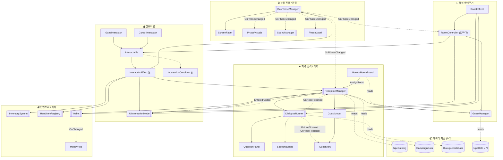

---

## 2. 싱글턴 & 정적 접근

| 클래스 | 접근 | 역할 | 씬 배치 |
|---|---|---|---|
| `DayPhaseManager` | `.Instance` | 아침→점심→저녁→새벽 순환, 페이드 전환, `DayCount` | 1 |
| `GuestManager` | `.Instance` | `GuestState` 리스트 (판정·방배정·숙박비·청소요청) | 1 |
| `ReceptionManager` | `.Instance` | 저녁 접객 세션 + 손님 큐 + 방배정 상태 | 1 |
| `DialogueRunner` | `.Instance` | 대화 1회 오케스트레이션 (인사→질문허브→분기) | 1 |
| `UIInteractionMode` | `.Instance` | "화면고정" 모드 — 앵커 스택, 플레이어 정지/커서 | 1 |
| `InventorySystem` | `.Instance` | 5슬롯 손 아이템 (줍기/사용/던지기) | 1 |
| `HandItemRegistry` | `.Instance` | `ItemId → 손 오브젝트` 조회 | 1 |
| `Wallet` | `.Instance` | 소지금, `RoomRate`, `OnChanged` 이벤트 | 1 |
| `ScreenFader` | `.Instance` | 전체 화면 검정 페이드 (`FadeThrough`) | 1 (선택) |
| `SoundManager` | `.Instance` | 앰비언스 스왑 + `PlayFootstep` | 1 |
| `ScreenMessage` | `.Instance` | 화면 중앙 임시 문구 (`Show(en,ko)`) | 1 (선택) |
| `LocalizationManager` | `.Current` / `.Korean` / `.T(en,ko)` (static) | 게임 시작 시 언어 확정, 이후 읽기 전용 | 1 |

---

## 3. 데이터 자산 (ScriptableObject) & 임포터

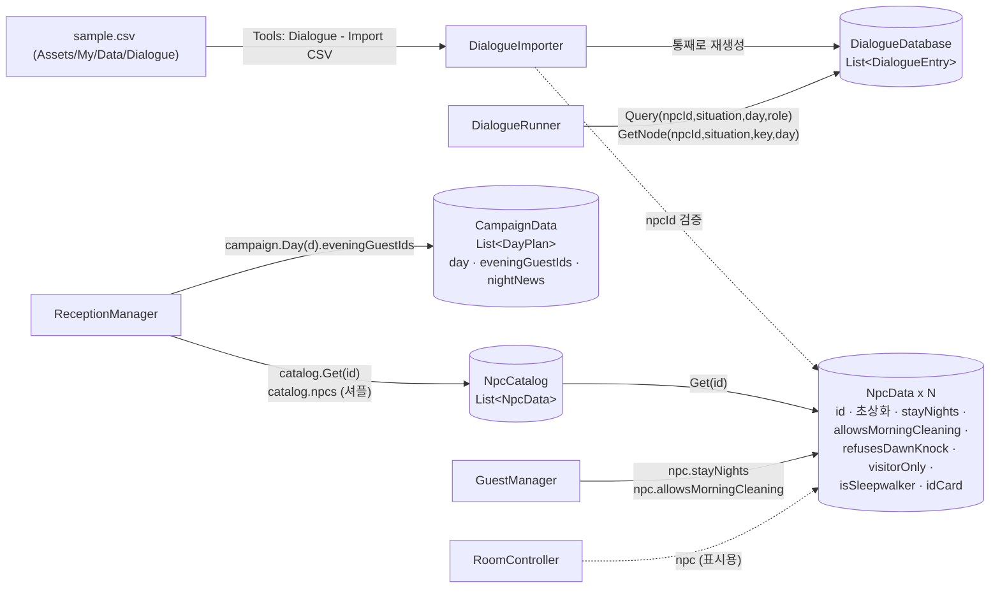

- **`DialogueEntry`** = `(npcId, situation, day, role, nodeKey)` + `lines[]` + `choices[]` + `goToNode` + `outcome`.
  - `role`: `Greeting`(자동) / `Question`(허브 버튼) / `Node`(goto 로만 도달).
  - `choices` 있는 `Question` = **결정 토픽** → 한 번 고르면 허브에서 사라짐 (`doc/0138`).
- `DialogueDatabase.asset` 은 **손으로 편집 금지** — CSV → 임포터가 재생성.

---

## 4. 이벤트 버스 (발행 → 구독)

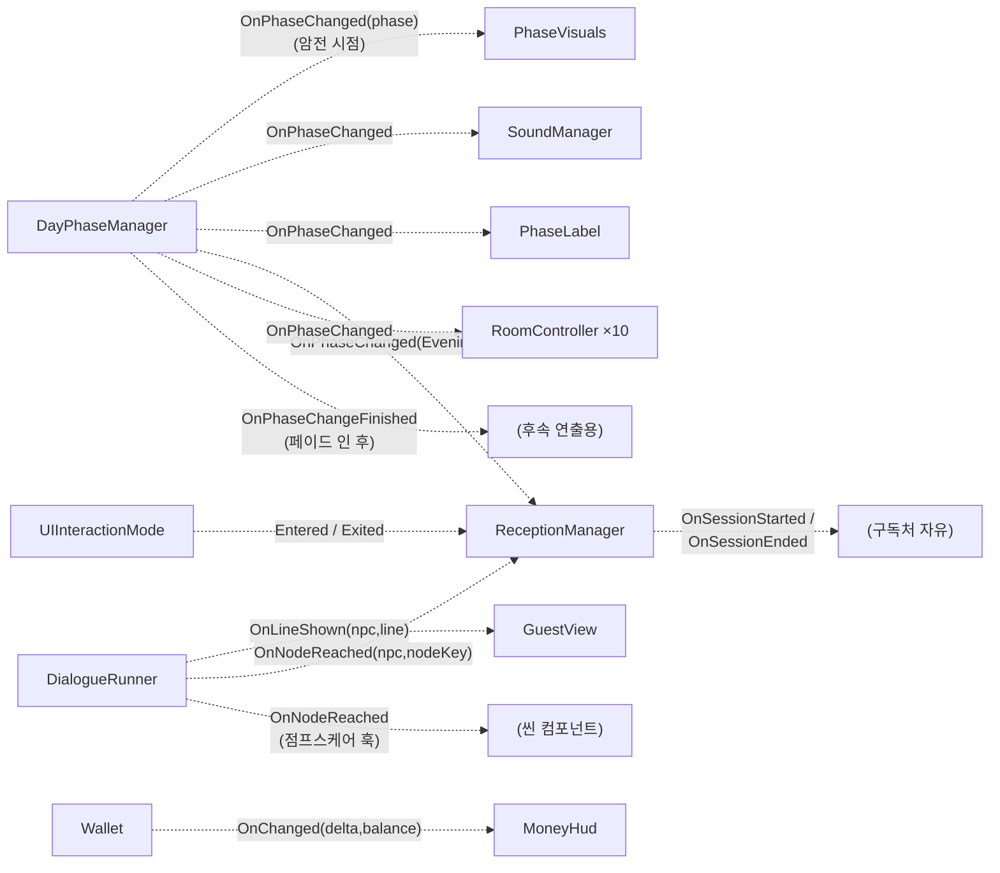

| 이벤트 | 발행 시점 | 구독자가 하는 일 |
|---|---|---|
| `DayPhaseManager.OnPhaseChanged` | 페이드 **암전** 순간 | 게이팅·비주얼 즉시 적용 (페이드에 가려짐) |
| `DayPhaseManager.OnPhaseChangeFinished` | 페이드 **인 완료** 후 | 후속 연출 |
| `DialogueRunner.OnLineShown` | 대사 줄 표시 직전 | `GuestView` 표정(Neutral/Angry) 교체 |
| `DialogueRunner.OnNodeReached` | `nodeKey` 있는 노드 도달 | `ReceptionManager`: `clean_yes/no` → 청소요청, `stay_pay/trust` → 선/후불, `reject_double_accept` → 2배요금 |
| `UIInteractionMode.Entered/Exited` | 화면고정 진입 / 완전 종료 | `ReceptionManager` 접객 일시정지·재개·세션 정리 |
| `Wallet.OnChanged` | 잔액 변동 | `MoneyHud` 텍스트 + (입금이면) 현금음 |

---

## 5. 서브시스템 상세

### 5.1 하루 진행 / 환경 / 사운드

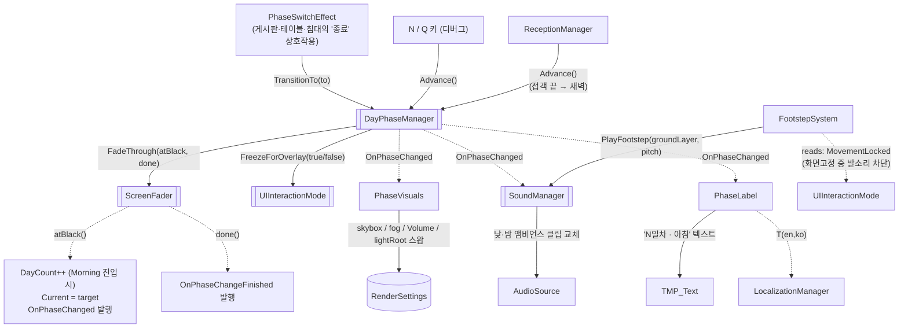

**하루 순환**: `Morning → Noon → Evening → Dawn →` (다음날 `Morning`, `DayCount++`).
`Evening` 진입 = `ReceptionManager` 자동 세션 시작. 접객 종료 = `Advance()` 로 `Dawn`.

### 5.2 상호작용 코어

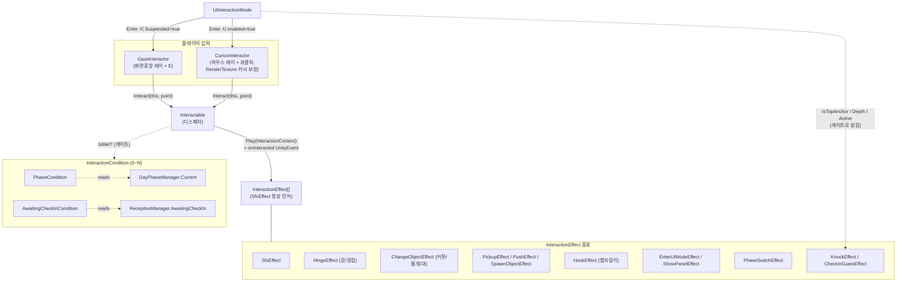

- **모델**: `GameObject` = `Interactable` 1개 + `InteractionEffect` N개 + `InteractionCondition` 0~N개.
- `Interactable.CanInteract` = `enabled && activeInHierarchy && 모든 Condition.IsMet`.
- `RoomController` 가 방 잠글 때 `Interactable.enabled = false` 로 개별 상호작용을 끈다.

### 5.3 상호작용 효과 → 시스템 연결

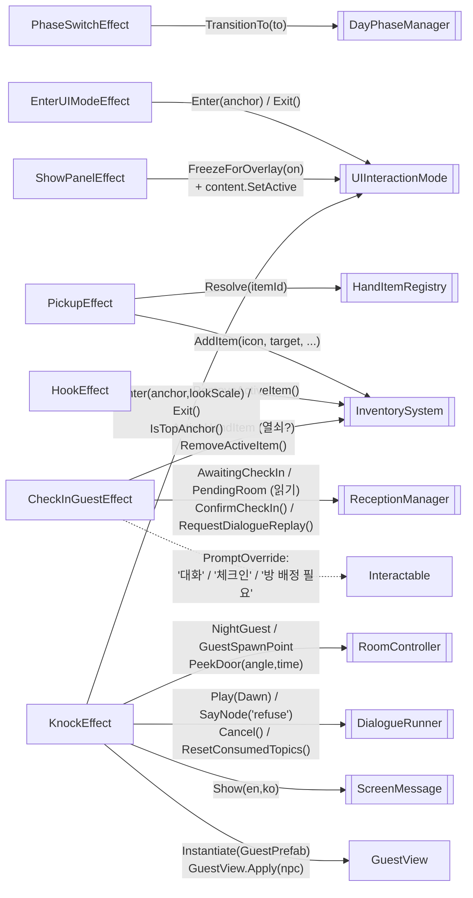

### 5.4 저녁 접객 (ReceptionManager 중심)

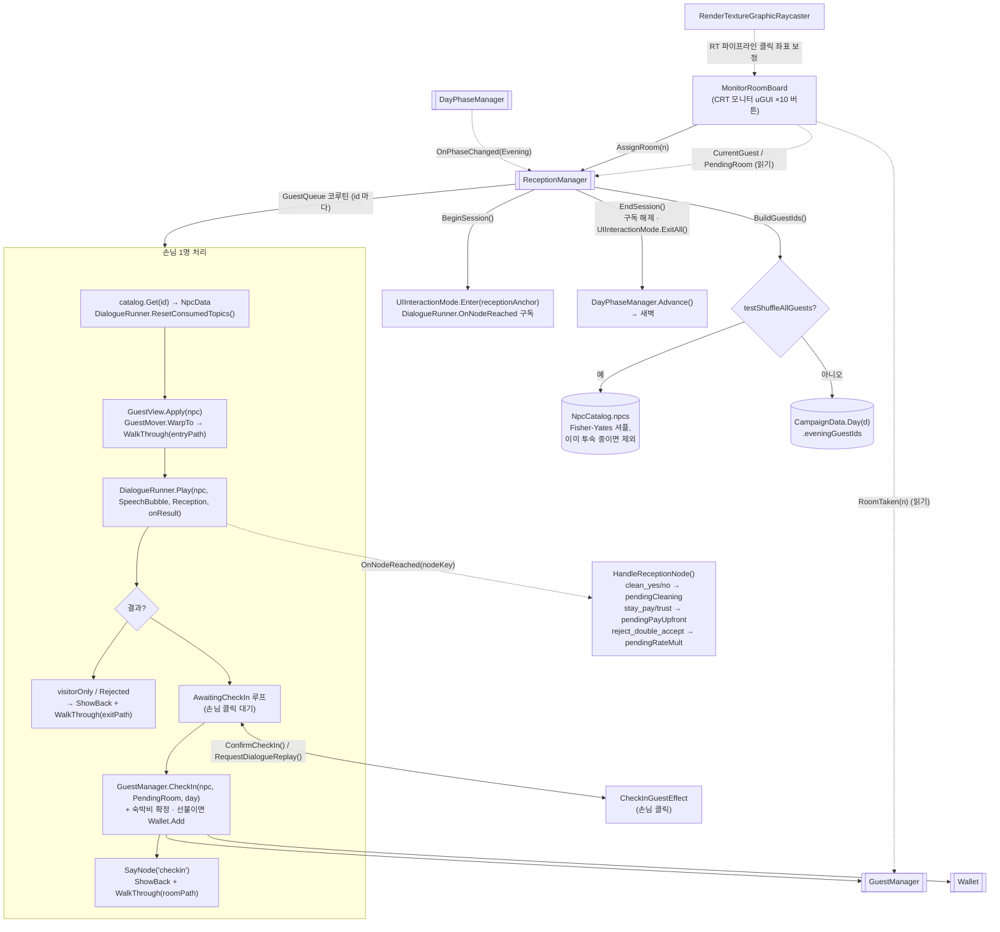

**일시정지**: 접객 중 `ESC` → `UIInteractionMode.Exited` → `ReceptionManager` 가 손님·대화 정지(`Paused`).
접객 테이블 재상호작용 → `Entered` → 재개.

### 5.5 대화 시스템

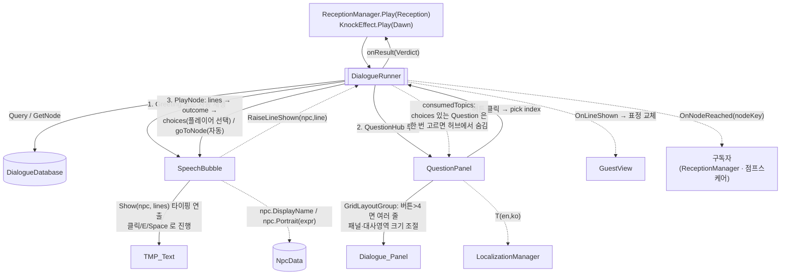

- `Play()` → `Run` 코루틴: **인사 → 질문 허브(반복) → 종료**. 거절 노드(`outcome=Rejected`) 도달 시 대화 전체가 거절로 끝남.
- `SayNode(key)` = 허브 없이 노드 1개만 (승인 후 "고맙다" / 새벽 "refuse").
- `Cancel()` = 진행 중 대화 즉시 중단 (노크 중 ESC).

### 5.6 객실 생애주기 (RoomController · GuestManager · Wallet)

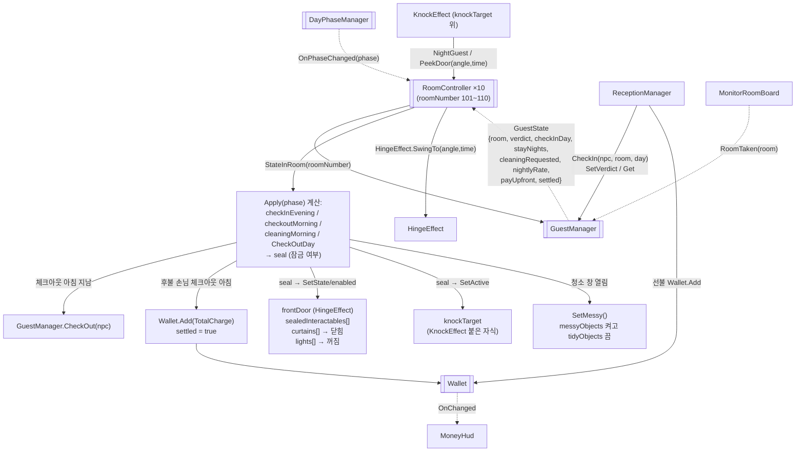

**방 상태 규칙** (체크인 = Day D 저녁, `stayNights` = N, 체크아웃 = Day D+N 아침):

| 단계 | 청소 허용 손님 | 청소 미허용 손님 |
|---|---|---|
| D 저녁 (체크인) | 개방 (걸어 들어옴) | 개방 |
| D 새벽 | 잠김 + 노크(탐문) · 커튼닫힘·소등 | 잠김 + 노크 |
| D+1 ~ D+N-1 아침 | **개방 (하우스키핑)** + 침대 흐트러짐 | 잠김 · 노크 시 "응답 없음" |
| 그 외 (점심·저녁·새벽) | 잠김 | 잠김 |
| **D+N 아침 (체크아웃)** | **개방 (대청소)** + 침대 흐트러짐, 후불이면 입금 | **개방 (대청소)**, 후불이면 입금 |
| D+N 점심 이후 | `CheckOut` → 빈방 (모니터 재배정 가능) | 동일 |

### 5.7 인벤토리 / UI 모드 / HUD

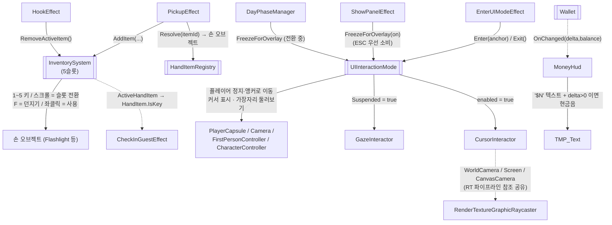

---

## 6. 핵심 루프 시퀀스 (저녁 → 새벽 → 아침)

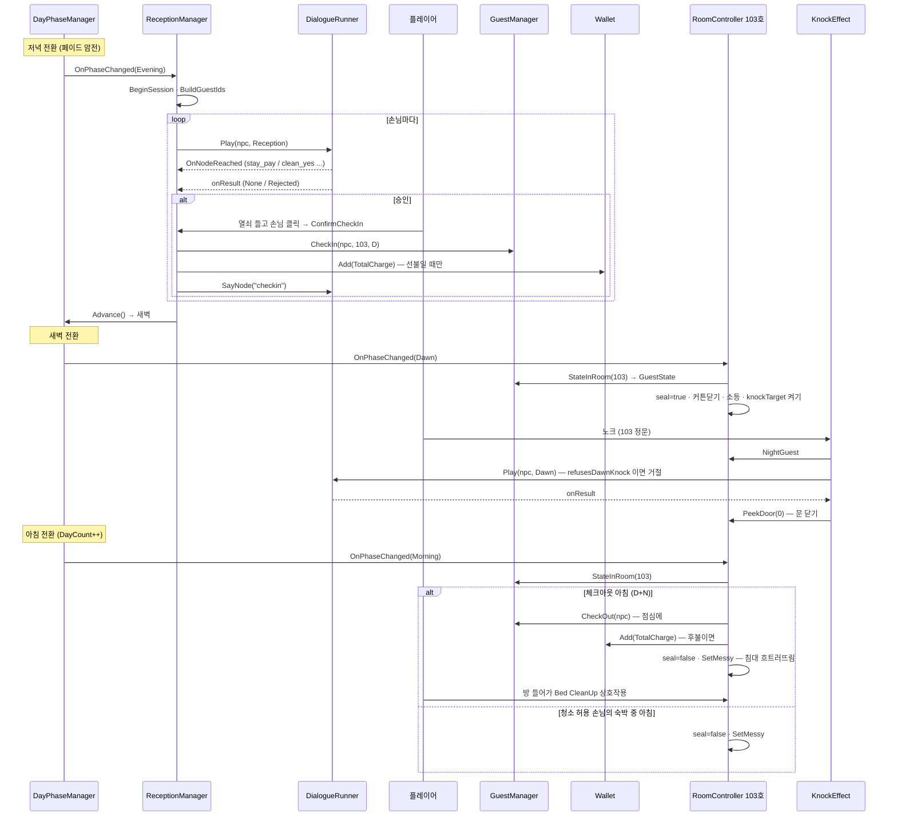

---

## 7. 유틸리티 / 보조 스크립트

| 스크립트 | 역할 | 연결 |
|---|---|---|
| `RenderTextureGraphicRaycaster` | 오브젝트 화면(CRT 모니터)에 얹은 World-Space uGUI 클릭 보정 | `CursorInteractor` 의 RT 참조 재사용 |
| `SpriteOutline` | 2D 스프라이트 손님 hover 하이라이트 (QuickOutline 대체) | `GazeInteractor` / `CursorInteractor` 가 토글 |
| `OutlineWhenOff` | 조명 스위치 등이 꺼져 있을 때 외곽선 상시 표시 | `Interactable.IsOn` 읽음 |
| `ItemImpactSound` | 던진/민 아이템이 부딪힐 때 효과음 | `PickupEffect` / `PushEffect` 와 함께 |
| `CartGroundAlign` | 카트류 오브젝트 지면 정렬 | 독립 |
| `FootstepSystem` | 이동 거리 누적 → 발소리 (화면고정 중엔 `UIInteractionMode.MovementLocked` 로 차단, doc/0142) | `SoundManager.PlayFootstep` |
| `LocalizedLabel` | 정적 UI 라벨 영/한 표시 | `LocalizationManager.T` |
| `ActivateOnAwake` | 런타임에 UI 오브젝트 켜기 (에디터에선 꺼둠) | 독립 |
| `PhaseLabel` | HUD "N일차 · 아침" | `DayPhaseManager.OnPhaseChanged` |
| `Expression` / `Situation` / `EntryRole` / `Verdict` / `ItemId` / `Language` (enum) | 대화·판정·아이템·언어 구분값 | 여러 곳 |

---

## 8. 한눈에 — 의존 방향 요약

```
입력(Interactor) → Interactable → Effect ──┬─▶ DayPhaseManager ──▶ ScreenFader
                                           ├─▶ UIInteractionMode ──▶ Player/Interactor
                                           ├─▶ InventorySystem ◀── HandItemRegistry
                                           └─▶ ReceptionManager ──▶ DialogueRunner ──▶ QuestionPanel / SpeechBubble
                                                     │                    │
                                                     ├─▶ GuestManager ◀───┤ (RoomController 도)
                                                     ├─▶ Wallet ──▶ MoneyHud
                                                     └─▶ MonitorRoomBoard

DayPhaseManager.OnPhaseChanged ──╌╌▶ PhaseVisuals · SoundManager · PhaseLabel · ReceptionManager · RoomController(×10)

데이터: sample.csv →[임포터]→ DialogueDatabase ;  NpcCatalog / CampaignData / NpcData(×N)
```

핵심 축은 **`DayPhaseManager` (시간)** 과 **`Interactable`+`Effect` (플레이어 행동)** 두 개.
나머지는 이 둘이 이벤트/호출로 깨우는 반응 시스템이다.

---

## 9. 이미지 생성 AI 에게 전달할 상세 설명

> 아래 텍스트를 다른 AI(이미지/다이어그램 생성)에 그대로 붙여넣으면 아키텍처 다이어그램을 그릴 수 있다.
> 위 mermaid 와 같은 내용이며, 렌더러가 없는 도구용 자연어 스펙이다.

### 그림 목적 · 스타일

Unity 1인칭 모텔 운영/공포 게임의 **런타임 스크립트 아키텍처 다이어그램**.
가로로 긴 캔버스, 좌→우로 데이터·제어 흐름. 박스 다이어그램(플로차트) 형태.
6개의 색이 다른 큰 그룹(묶음 상자) 안에 스크립트 박스들이 들어가고, 그룹을 가로지르는 화살표로 관계를 표시.

### 화살표 3종 (범례를 그림 구석에 넣을 것)

1. **굵은 실선 화살표** = 메소드 호출(명령). 화살표 옆에 메소드 이름 라벨.
2. **가는 점선 화살표** = 이벤트 구독(콜백 통지). 이벤트를 "발행"하는 쪽에서 "구독"하는 쪽으로. 라벨 = 이벤트 이름.
3. **얇은 도트 화살표** = 프로퍼티/상태 읽기(조회). 라벨 = "reads: 필드명".

박스 모양: 싱글턴은 **두꺼운 테두리 + 왕관/별 아이콘**, ScriptableObject 데이터는 **원통(DB) 모양**, 씬에 여러 개 존재하는 것(RoomController)은 **겹친 상자**.

### 그룹 A — "하루 진행 / 환경" (연파랑)

- **DayPhaseManager** (싱글턴, 이 그림의 왼쪽 중앙, 가장 중요). 상태: `Current`(Morning/Noon/Evening/Dawn), `DayCount`. 하루는 아침→점심→저녁→새벽 순환, 새 아침 진입 시 DayCount+1.
- **ScreenFader** (싱글턴). `FadeThrough(atBlack, done)` — 검정 페이드.
- **PhaseVisuals** — 스카이박스/조명/fog/PostProcess Volume 4단계 스왑.
- **SoundManager** (싱글턴) — 낮/밤 앰비언스 클립, `PlayFootstep(layer)`.
- **PhaseLabel** — HUD "N일차 · 아침" 텍스트.

내부 화살표:
- `PhaseSwitchEffect`(그룹 B) —실선 `TransitionTo(to)`→ DayPhaseManager
- 디버그 N/Q 키 —실선 `Advance()`→ DayPhaseManager
- ReceptionManager(그룹 C) —실선 `Advance()`→ DayPhaseManager (접객 끝나면 새벽으로)
- DayPhaseManager —실선 `FadeThrough()`→ ScreenFader
- DayPhaseManager —실선 `FreezeForOverlay()`→ UIInteractionMode(그룹 B)
- DayPhaseManager —**점선 이벤트 `OnPhaseChanged`**→ PhaseVisuals, SoundManager, PhaseLabel, ReceptionManager(그룹 C), RoomController(그룹 D) **다섯 갈래**
- FootstepSystem —실선 `PlayFootstep()`→ SoundManager

### 그룹 B — "상호작용 시스템" (연초록)

- **GazeInteractor** (화면 중앙 레이 + E 키), **CursorInteractor** (마우스 레이 + 좌클릭, RenderTexture 커서 보정). 둘 다 `Interactor` 상속.
- **Interactable** — 디스패처. 한 GameObject = Interactable 1 + Effect N + Condition 0~N.
- **InteractionEffect (여러 종류)**: SfxEffect, HingeEffect(문), ChangeObjectEffect(커튼·불·침대), PickupEffect/PushEffect/SpawnObjectEffect, HookEffect(열쇠걸이), EnterUIModeEffect·ShowPanelEffect(화면고정/읽기), PhaseSwitchEffect, KnockEffect, CheckInGuestEffect.
- **InteractionCondition (게이트)**: PhaseCondition(특정 시간대만), AwaitingCheckInCondition(접객 대기 중만).
- **UIInteractionMode** (싱글턴) — "화면고정" 모드. 앵커 스택. 플레이어 이동/시야 정지 + 마우스 커서.

내부 화살표:
- GazeInteractor, CursorInteractor —실선 `Interact(this, point)`→ Interactable
- Interactable —도트 `reads: IsMet`→ InteractionCondition
- Interactable —실선 `Play(context)`→ InteractionEffect (SfxEffect가 항상 먼저 실행)
- PhaseCondition —도트 `reads: Current`→ DayPhaseManager(그룹 A)
- AwaitingCheckInCondition —도트 `reads: AwaitingCheckIn`→ ReceptionManager(그룹 C)
- UIInteractionMode —실선 `Suspended=true` / `enabled=true`→ GazeInteractor / CursorInteractor

Effect → 다른 시스템 (그룹 경계 넘는 화살표, 전부 실선):
- PhaseSwitchEffect → DayPhaseManager: `TransitionTo(to)`
- EnterUIModeEffect → UIInteractionMode: `Enter(anchor)` / `Exit()`
- ShowPanelEffect → UIInteractionMode: `FreezeForOverlay(on)`
- PickupEffect → HandItemRegistry: `Resolve(itemId)`, → InventorySystem: `AddItem(...)`
- HookEffect → InventorySystem: `RemoveActiveItem()`
- CheckInGuestEffect → InventorySystem: `ActiveHandItem`(열쇠 확인), `RemoveActiveItem()` ; → ReceptionManager: `ConfirmCheckIn()` / `RequestDialogueReplay()` ; 도트로 `reads: AwaitingCheckIn, PendingRoom`
- KnockEffect → RoomController: `NightGuest`, `PeekDoor(angle,time)` ; → UIInteractionMode: `Enter/Exit` ; → DialogueRunner: `Play(Dawn)` / `SayNode("refuse")` / `Cancel()` / `ResetConsumedTopics()` ; → ScreenMessage: `Show(en,ko)`

### 그룹 C — "저녁 접객 / 대화" (연노랑)

- **ReceptionManager** (싱글턴) — 저녁이 되면 자동으로 접객 세션 시작. 손님 큐 코루틴. 상태: `CurrentGuest`, `PendingRoom`, `AwaitingCheckIn`, `Paused`.
- **DialogueRunner** (싱글턴) — 대화 1회: 인사 → 질문 허브(반복 선택) → 분기 → 종료. `consumedTopics`(선택지 있는 질문은 한 번 고르면 숨김). 이벤트 `OnLineShown`, `OnNodeReached`.
- **QuestionPanel** — 질문/선택지 버튼 UI (GridLayoutGroup, 버튼 5개↑ 이면 여러 줄).
- **SpeechBubble** — 타이핑 연출 대사창. 클릭/E/Space로 진행.
- **GuestView** — 재활용되는 손님 오브젝트의 스프라이트/표정 교체.
- **GuestMover** — 손님 웨이포인트 이동 (입장/퇴장/방으로).
- **MonitorRoomBoard** — CRT 모니터 화면 위 방배정 버튼 10개(101~110).

내부/외부 화살표:
- DayPhaseManager —점선 이벤트 `OnPhaseChanged(Evening)`→ ReceptionManager
- ReceptionManager —실선 `Play(npc, Reception)`→ DialogueRunner
- ReceptionManager —실선 `CheckIn / SetVerdict / Get`→ GuestManager(그룹 D)
- ReceptionManager —실선 `Add(TotalCharge)` (선불)→ Wallet(그룹 E)
- ReceptionManager —실선 `Enter/ExitAll`→ UIInteractionMode(그룹 B)
- UIInteractionMode —점선 이벤트 `Entered / Exited`→ ReceptionManager (접객 일시정지/재개)
- ReceptionManager —실선 `WarpTo / WalkThrough(path)`→ GuestMover —실선→ GuestView
- ReceptionManager —도트 `reads: catalog.Get(id), catalog.npcs`→ NpcCatalog(그룹 F)
- ReceptionManager —도트 `reads: campaign.Day(d).eveningGuestIds`→ CampaignData(그룹 F)
- DialogueRunner —실선 `Show(labels)`→ QuestionPanel ; QuestionPanel —실선 `pick index`→ DialogueRunner
- DialogueRunner —실선 `Show(npc, lines)`→ SpeechBubble ; SpeechBubble —점선 `RaiseLineShown`→ DialogueRunner
- DialogueRunner —점선 이벤트 `OnLineShown`→ GuestView (표정 교체)
- DialogueRunner —점선 이벤트 `OnNodeReached`→ ReceptionManager (`clean_yes/no`→청소요청, `stay_pay/trust`→선/후불, `reject_double_accept`→2배요금)
- DialogueRunner —도트 `reads: Query / GetNode`→ DialogueDatabase(그룹 F)
- DialogueRunner —도트 `reads: consumedTopics`→ QuestionPanel (숨길 버튼)
- MonitorRoomBoard —실선 `AssignRoom(n)`→ ReceptionManager
- MonitorRoomBoard —도트 `reads: CurrentGuest, PendingRoom`→ ReceptionManager ; —도트 `reads: RoomTaken(n)`→ GuestManager(그룹 D)
- RenderTextureGraphicRaycaster —도트 "RT 클릭 좌표 보정"→ MonitorRoomBoard

### 그룹 D — "객실 생애주기" (연주황)

- **RoomController** (겹친 상자, 방마다 1개 ×10, roomNumber 101~110) — `OnPhaseChanged` 구독. `Apply(phase)` 에서 `seal`(잠금 여부) 계산: 체크인한 저녁 제외, 체크아웃까지 잠금, 청소 허용 손님은 숙박 중 매일 아침 개방, 체크아웃 아침 개방.
- **GuestManager** (싱글턴) — `GuestState` 리스트. 필드: room, verdict, checkInDay, stayNights, cleaningRequested, nightlyRate, payUpfront, settled. `CheckOutDay = checkInDay + stayNights`.
- **KnockEffect** — RoomController 의 knockTarget(정문 자식)에 붙는 Effect. 새벽 노크: 화면고정 → 3초 → (거절이면 ScreenMessage만) / (수락이면 문 살짝 열림 + 손님 스프라이트 스폰 + 새벽 대화).

내부/외부 화살표:
- DayPhaseManager —점선 이벤트 `OnPhaseChanged`→ RoomController
- RoomController —실선 `StateInRoom(roomNumber)`→ GuestManager ; GuestManager —도트 `GuestState`→ RoomController
- RoomController —실선 `CheckOut(npc)`→ GuestManager (체크아웃 아침 지나면)
- RoomController —실선 `Add(TotalCharge)` (후불 정산)→ Wallet(그룹 E)
- RoomController —실선 `SetState / enabled`→ frontDoor·sealedInteractables·curtains(닫힘)·lights(꺼짐) 의 Interactable(그룹 B)
- RoomController —실선 `SetActive`→ knockTarget (KnockEffect 붙은 자식)
- RoomController —실선 `SetMessy()`→ 침대 messy/tidy 오브젝트 토글 (청소 창 열릴 때)
- KnockEffect —실선 `NightGuest / PeekDoor(angle,time)`→ RoomController
- KnockEffect —실선 `Play(Dawn)`→ DialogueRunner(그룹 C)

### 그룹 E — "인벤토리 / 재화" (연보라)

- **InventorySystem** (싱글턴) — 5슬롯 손 아이템. 1~5키/스크롤 전환, F 던지기, 좌클릭 사용.
- **HandItemRegistry** (싱글턴) — `ItemId → 손 오브젝트`.
- **Wallet** (싱글턴) — `Balance`, `RoomRate`(기본 70). 이벤트 `OnChanged(delta, balance)`.
- **MoneyHud** — 소지금 텍스트 + 입금 시 현금 효과음.

화살표:
- PickupEffect(그룹 B) —실선 `AddItem`→ InventorySystem ; —실선 `Resolve(itemId)`→ HandItemRegistry
- InventorySystem —도트 `reads: ActiveHandItem → IsKey`→ CheckInGuestEffect(그룹 B)
- ReceptionManager(그룹 C), RoomController(그룹 D) —실선 `Add(amount)`→ Wallet
- Wallet —점선 이벤트 `OnChanged`→ MoneyHud

### 그룹 F — "데이터 자산 (ScriptableObject)" (회색, 원통 모양)

- **sample.csv** (파일) —실선 "Tools ▸ Dialogue ▸ Import CSV"→ **DialogueImporter** —실선 "통째로 재생성"→ **DialogueDatabase** (`List<DialogueEntry>`; entry = npcId·situation·day·role·nodeKey + lines + choices + goToNode + outcome).
- **NpcData ×N** (NPC마다 1개: id, 초상화, stayNights, allowsMorningCleaning, refusesDawnKnock, visitorOnly, isSleepwalker, idCard).
- **NpcCatalog** (`List<NpcData>`, `Get(id)`).
- **CampaignData** (`List<DayPlan>`: day, eveningGuestIds, nightNews).
- DialogueImporter —점선 "npcId 검증"→ NpcData
- NpcCatalog —실선 `Get(id)`→ NpcData
- GuestManager(그룹 D) —도트 `reads: npc.stayNights, npc.allowsMorningCleaning`→ NpcData

### 별도(그룹 밖) — LocalizationManager

정적 클래스. `T(en, ko)` / `Korean`. Interactable(프롬프트), NpcData(이름), QuestionPanel, ScreenMessage, PhaseLabel, MonitorRoomBoard 등이 표시 직전에 읽음 (읽기 전용, 이벤트 없음). 그림에서는 오른쪽 아래에 작게, 여러 곳에서 오는 도트 화살표를 받는 노드로.

### 레이아웃 제안

왼쪽부터: [그룹 A 하루진행] → [그룹 B 상호작용] → 위쪽 [그룹 C 접객/대화] · 아래쪽 [그룹 D 객실] → 오른쪽 [그룹 E 재화] → 맨 오른쪽 [그룹 F 데이터].
`DayPhaseManager` 와 `Interactable` 를 시각적으로 가장 크게(핵심 축 2개). `OnPhaseChanged` 5갈래 점선을 눈에 띄게.
